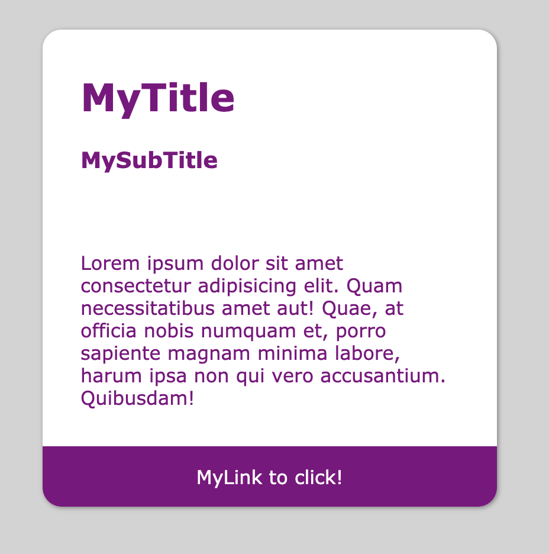

# card-css
# Create a card using html and css only with no framework nor library.



>HTML5 card representation

```html
    <div class="card">
        <header>
            <h1>MyTitle</h1>
            <h3>MySubTitle</h3>
        </header>
        <section>
            <p>Lorem ipsum dolor sit amet consectetur adipisicing elit. Quam necessitatibus amet aut! Quae, at officia nobis numquam et, porro sapiente magnam minima labore, harum ipsa non qui vero accusantium. Quibusdam!</p>
        </section>
        <footer>
            <a href="http://coderbr.com">MyLink to click!</a>
        </footer>
    </div>
```

>Apply css style
```css
    .card {
        min-width: 16rem;
        max-width: 24rem;
        background-color: white;
        margin: 2rem;
        color: purple;
        border-radius: 1rem;
        box-shadow: 1px 1px 4px gray;
    }

    .card header, .card section, .card footer {
        padding: 1rem 2rem;
    }

    .card footer {
        background-color: purple;
        text-align: center;
        border-radius: 0% 0% 1rem 1rem;
    }

    .card footer a {
        color: white;
        text-decoration: none;
    }
```
